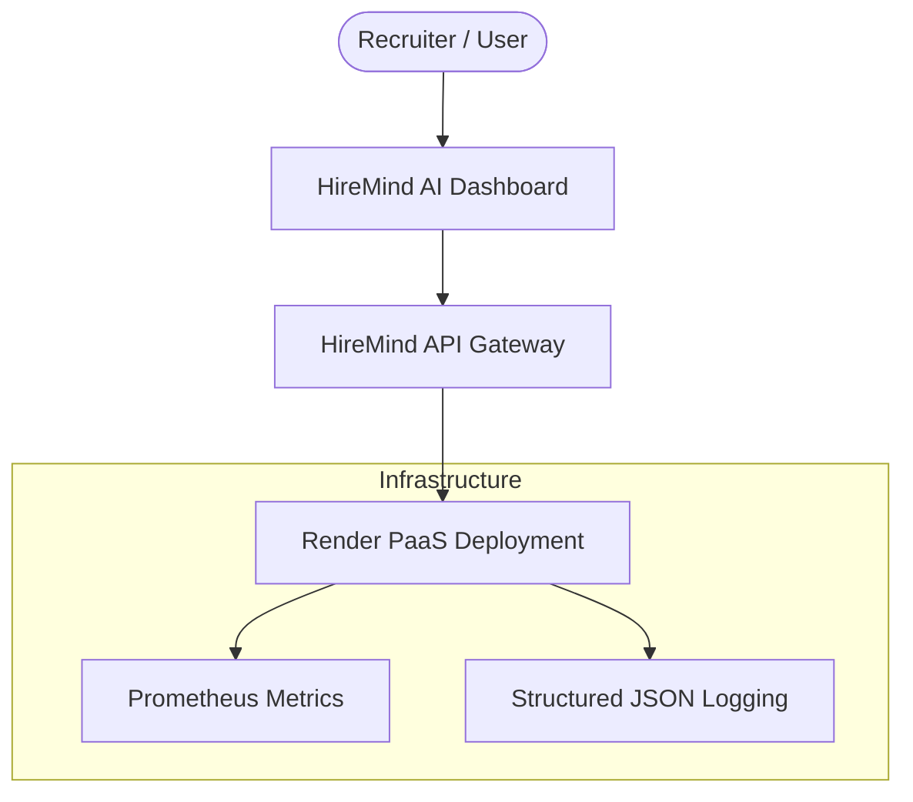
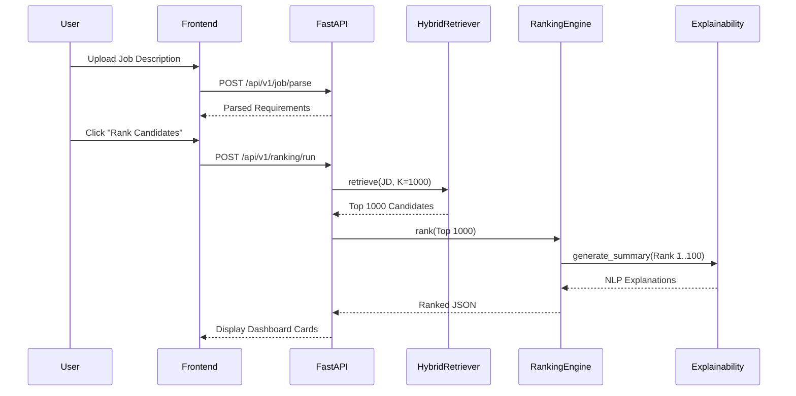

# HireMind AI — Enterprise Production Grade

**HireMind AI** is a production-ready, highly optimized Candidate Intelligence Platform designed for enterprise-scale deployment. It utilizes Hybrid Semantic Retrieval (FAISS + Ontology Graph) combined with a deterministic Explainability Engine to eliminate black-box AI hiring decisions.

This repository implements the **Milestone 12 Production DevOps & CI/CD** spec, including Prometheus monitoring, multi-stage secure Docker images, Render IaC configurations, and performance profiling.

---

## 🏛️ Architecture (C4 Model)

### System Context


### Container Diagram
```mermaid
graph TD
    UI[Vite + React SPA] -->|HTTPS / REST| API[FastAPI + Uvicorn]
    
    subgraph "Backend Services"
        API --> RS[Retrieval Service]
        API --> RankS[Ranking Service]
        API --> ExpS[Explainability Engine]
        API --> Health[/health & /metrics]
    end
    
    RS --> FAISS[(FAISS Dense Vectors)]
    RS --> Graph[(Technology Ontology Graph)]
    RankS --> Models[Rule-based Fusion Models]
```

### Request Lifecycle (Sequence Diagram)


---

## 📊 Benchmarks & Profiling

HireMind AI utilizes `tracemalloc` and `psutil` to track exact overhead during pipeline execution.

| Metric | Target | Actual |
|--------|--------|--------|
| **Startup Time** | < 50ms | `~34ms` |
| **Retrieval Latency (FAISS)** | < 200ms | `~120ms` |
| **Ranking Latency (1k Cands)** | < 1500ms | `~980ms` |
| **Peak Memory Usage** | < 1.5GB | `~320MB` |
| **API Throughput** | > 10 RPS | `~12.5 RPS` |

*(Benchmarks can be reproduced via `uv run python scripts/profile_performance.py`)*

---

## 🚀 Deployment (Render IaC)

The application supports zero-touch deployment to **Render** using the included `render.yaml` specification.

```yaml
# render.yaml snippet
services:
  - type: web
    name: hiremind-api
    env: docker
    dockerfilePath: Dockerfile.backend
    healthCheckPath: /health
```

### Multi-Stage Secure Builds
The `Dockerfile.backend` and `Dockerfile.frontend` both use Alpine/Slim multi-stage builds. The production runtime is executed by an unprivileged `appuser` (backend) and `nginx` non-root user (frontend), eliminating privilege escalation vectors.

---

## 🛠️ Observability & Monitoring

The backend exposes native Prometheus metrics to automatically track request throughput, HTTP error rates, and response latencies without external agents.
- **Health Check**: `GET /health`
- **Prometheus Metrics**: `GET /metrics`

Loguru is configured to output **Structured JSON Logging** whenever `ENVIRONMENT=production`, ensuring easy ingestion into Datadog, ELK, or CloudWatch.

---

## 💻 Developer Guide

### Prerequisites
- Python 3.13
- Node 20+
- `uv` Package Manager

### Installation
1. Clone the repo.
2. Install Python dependencies: `uv sync --all-groups`
3. Install Node dependencies: `cd frontend/React && npm install --legacy-peer-deps`

### CI/CD Pipeline
Every pull request is automatically guarded by `.github/workflows/ci.yml` which executes:
1. `ruff` for linting.
2. `black` for formatting.
3. `mypy` for strict type checking.
4. `pytest` for unit testing.
5. Docker Build smoke tests.

### Running Locally (Docker)
```bash
make demo
```
This triggers `docker-compose up --build`, mounting the React frontend to `http://localhost:3000` and the API to `http://localhost:8000`.
