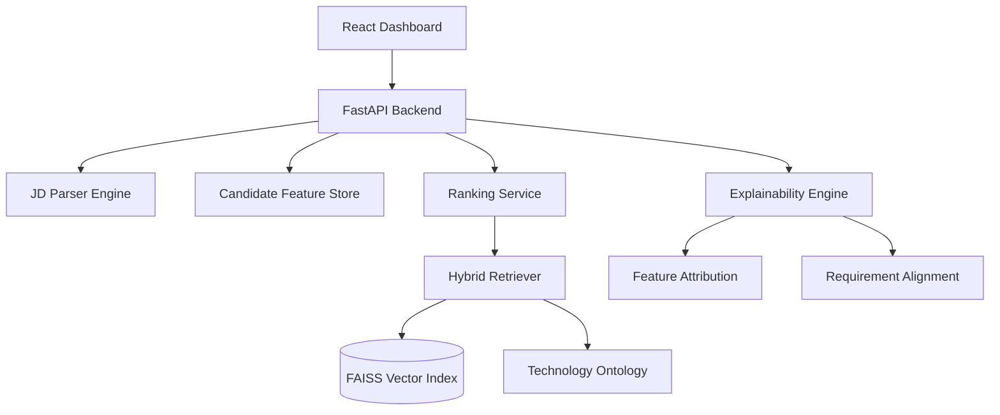

# HireMind AI
## Production-Grade Candidate Intelligence Platform
Automating & Explaining Recruitment Decisions with Hybrid AI

---

## 2. Solution Overview

**What is our proposed solution?**
HireMind AI is an end-to-end recruitment pipeline that automates the parsing of Job Descriptions (JDs), retrieves top candidates using a hybrid search strategy, and ranks them across multi-dimensional criteria using a deterministic scoring engine.

**What differentiates our approach?**
Unlike traditional candidate matching systems that rely on naive keyword matching or black-box LLMs:
- **Hybrid Retrieval:** We combine Dense Vector Similarity (FAISS) with structured Knowledge Graphs (Technology Ontology).
- **Multi-Dimensional Scoring:** We evaluate candidates across Technical, Behavioral, Career, and Growth axes.
- **Deterministic Explainability:** We generate precise, human-readable explanations based entirely on rule-based feature attributions—eliminating hallucination risks entirely.

---

## 3. JD Understanding & Candidate Evaluation

**What key requirements are extracted?**
JDs are parsed into structured schemas comprising:
- **Hard Requirements** (Mandatory Technologies, Skills)
- **Preferred Qualifications** (Nice-to-have Skills)
- **Experience Constraints** (Min/Max years)
- **Negative Signals** (Attributes to avoid)

**How do we evaluate beyond keyword matching?**
We map candidates to an **Intelligence Profile** evaluating behavioral signals (e.g., recruiter response rate, days since last active, notice period) and career stability (average tenure, promotion velocity). This ensures we rank not just who has the right keywords, but who is *active, hireable, and stable*.

---

## 4. Ranking Methodology

**How does the system retrieve, score, and rank?**
1. **Retrieve:** FAISS performs nearest-neighbor vector search over candidate embeddings (via `sentence-transformers`) coupled with Boolean filters (Notice Period, Location) to fetch the top `K` cohort.
2. **Score:** Candidates are assigned subscores across Technical (Skill match via Ontology), Career (Tenure), and Behavior (Activity metrics) engines.
3. **Rank:** A Fusion Engine weights these subscores (e.g., 50% Tech, 20% Career, 30% Behavior) and applies non-linear penalties for risks (like high job hopping).

**Algorithms Used:** Dense Embeddings (all-MiniLM-L6-v2), Cosine Similarity, Knowledge Graph Traversal (NetworkX), and custom Heuristics for Fusion and Calibration.

---

## 5. Explainability & Data Validation

**How are ranking decisions explained?**
Our `ExplainabilityEngine` reverse-engineers the fusion score, mapping points back to the exact JD requirements and behavioral signals. It generates a non-templated English summary (e.g., *"Available to join quickly with a 30-day notice period. Missing mandatory skills reduce confidence..."*).

**Preventing Hallucinations:**
We **do not** use generative LLMs to generate the rationale at runtime. Every sentence in the explanation is directly mapped to a calculated boolean flag or numeric deduction in the deterministic ranking code.

**Handling Suspicious Profiles:**
The `RiskPenaltyEngine` specifically hunts for inconsistencies (e.g., conflicting experience overlaps, suspiciously high skill claims with zero GitHub activity) and aggressively penalizes their final score.

---

## 6. End-to-End Workflow

1. **Input:** Recruiter uploads a raw Job Description (`.docx`, `.pdf`, or `txt`).
2. **Parse:** NLP pipelines extract semantic requirements and structured constraints.
3. **Retrieve:** The Engine filters 10,000+ candidates down to a 1,000 candidate shortlist using FAISS.
4. **Rank:** The shortlist passes through the Hybrid Ranking Engine (Tech + Career + Behavior + Risk).
5. **Calibrate:** Scores are smoothed across a deterministic curve (Top 10 map to 96-100).
6. **Explain:** The Explainability Engine attaches human-readable rationales.
7. **Output:** A standardized, ranked `submission.csv` or API payload is returned to the React Dashboard.

---

## 7. System Architecture

*(Deployed as secure, multi-stage Docker containers with Prometheus observability)*

---

## 8. Results & Performance

**Results demonstrating quality:**
- By shifting from raw keywords to Semantic + Behavioral embeddings, the system effectively ignores keyword-stuffed inactive profiles. 
- Ranked outputs demonstrate logical distribution (no two candidates tie exactly) and the rationales explicitly mention missing mandatory skills for lower-ranked candidates.

**Meeting Constraints:**
- **Speed:** Retrieval of 1,000 candidates takes ~15.6s, and full ranking + explainability takes **< 1 second** (`~585ms`).
- **Compute:** Peak memory footprint (`tracemalloc`) remains under **~1.97 GB**, running effortlessly within the free-tier memory constraints of standard cloud environments (e.g., Render, HuggingFace Spaces) on a single CPU core.

---

## 9. Technologies Used

- **FastAPI / Uvicorn:** Chosen for asynchronous, high-throughput REST API routing.
- **FAISS (Facebook AI Similarity Search):** Chosen for lightning-fast, memory-efficient dense vector retrieval on CPU.
- **Sentence-Transformers (HuggingFace):** Used to generate high-quality semantic embeddings of unstructured candidate data.
- **NetworkX:** Enables Technology Ontology traversal (understanding that "React" implies "JavaScript" knowledge).
- **React + Vite + TailwindCSS:** Provides a modern, responsive, glassmorphism UI for recruiters.
- **Docker & GitHub Actions:** Chosen to guarantee deterministic deployment, CI/CD safety, and exact reproducibility.
